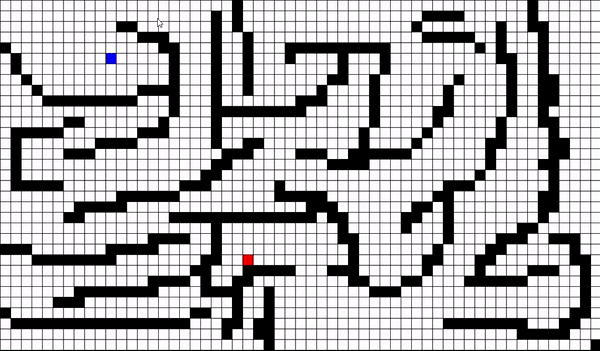

# A-Star-Algorithm-visualization

A* Path finding algorithm beautifully visualized in python with random wall generation feature.

## A Star in Action

  

- Currently benchmarked @29,900 cells with 9000 blocker cells

  

## Pseudocode

1. Create a Grid consisting of cells.
2. Mark a start and end point for the grid
3. For each cell except (start and End cell ) calculate g and h , make calculate 
F score = g + h.
- ‘g’ is distance from current cell to start cell 
- ‘h’ is distance from current cell to end cell
  
‘H’ is heuristic value : can be calculated in the following ways
- Manhattan distance
- Euclidean distance
- Diagonal distance
4.  We are going to perform two operations on cells **Search** and **Discovery**.
   
           Search : for current cell which is marked as **Searched** [red color] if discovery operation 
                          is done for surrounding cells  and **discovered** cells are updated .From all  
                          **discovered** [green cells] with the  least f score is selected for the next **Search** 
                          operation.

           Discovery : for a cell which is being **Searched** , if the surrounding cells whose f score is 
                                not initialized or cell has not yet been **discovered** , when f score is updated 
                                for that cell then that cell is marked as **discovered** [green color]
          

  5.   For each cell surrounding from start cell , f score is calculated and       
       Updated by doing discovery operation. (marked as **discovered** cells [green color])
  6.   Next **Search** operation is done for the **discovered** cells then mark that cell as **Searched**  
       cell [red color]
      
  7.   When doing discovery operation ,  if surrounding cell has already **discovered** cell and  
       has a f score . check if the : 

            if  (g score of Searched cell) + (distance which would Take  to  travel from currently
            Searched cell and discovered cell) < g score of  currently discovered cell:
            {
            g score for the currently discovered cell updated as =             
            (g score of Searched cell) + (distance which would Take  to  travel from currently
            Searched cell and discovered cell).
            } 

  9. Repeat this process of **Search** and discover until the End cell is found 

  10. Backtracking is the neat part , after end cell is found now , you have **Searched** and  
     **discovered** cells with g , h and f scores updated for these now. You will have to follow 
     along cells which are **Searched** ones [marked in red color] based on g value only. 
     [ we are taking g value only since it has distance score from start cell for each cell]
  11. From end cell’s surrounding cell start backing by getting surrounding cell’s g score
      Go to the cell which has least g score , repeat this process by traversing across cells 
      whose surrounding cells  have least g score [while choosing the cell which has least g
      score mark the cell as purple color or any color of your choice].repeat until start cell is 
      found as a surrounding cell.

   12. Voila now you have your A* algorithm done with purple color defining your path from 
       start to end cell
       
